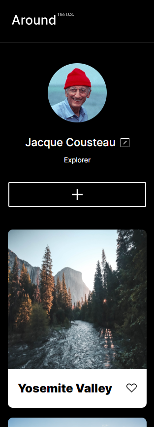

# Project 3: Around The U.S.

### Overview

- Project Description
- Techniques and Technology
- Images
- Github Link

**Project Description**

The intention behind this project is to create an interactive webpage that users can modify through creating their own public profiles with a name, description and profile image, adding and removing photos, and liking photos shared by other users.

**Techniques and Technology**

This project is meant to showcase a culmination of my understanding of HTML and CSS coding, combining skills like flex containers, grids, and responsive design principles to create a webpage with a variety of subtle tricks that transitions seamlessly between desktop and mobile version layouts.

**Images**

This screenshot of the webpage shows the grid layout of the customizable user cards in a standard desktop view with a width of 1280px.

This screenshot of the webpage shows the responsive layout adjusted to a viewport of 320px or an average smart phone dislay.

**Github Link**

- [Link to the project](https://anthonyzisa.github.io/se_project_aroundtheus/)
